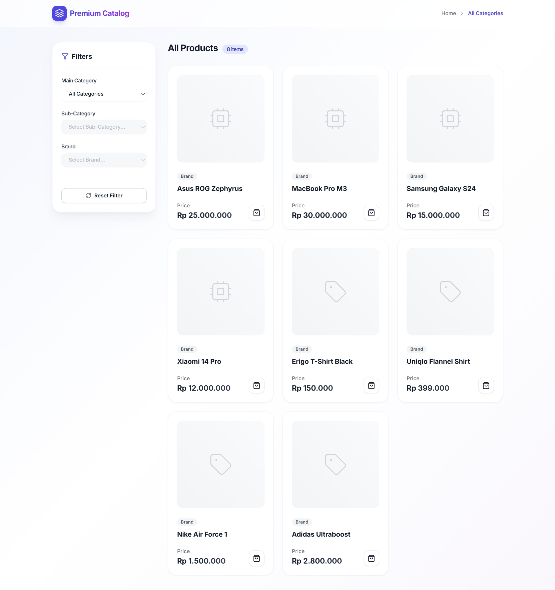
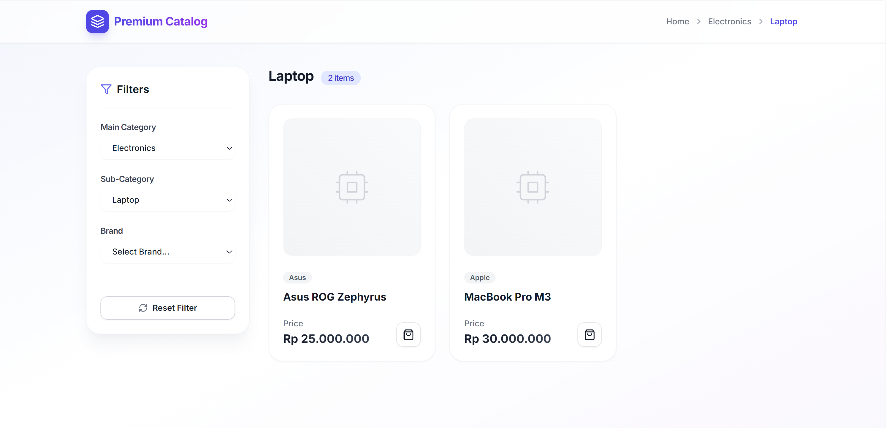
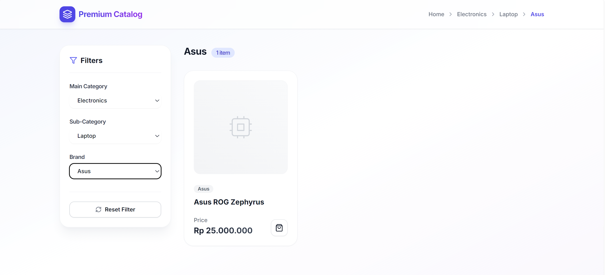

# Premium Dynamic Product Catalog

This project implements a dynamic product catalog page featuring cascading dropdown filters. It is built strictly using **React Router DOM v6** (with the Data API), **Vite**, and **Tailwind CSS**. No external state management or form libraries were used.

## 🚀 Features

- **Data Router approach:** Utilizes `createBrowserRouter` and route `loader` functions to simulate data fetching and compute exact data payloads.
- **URL-first State Management:** The entire application state (category, subcategory, brand filters) is synchronized with URL Search Parameters. This ensures complete state persistence across browser reloads.
- **Cascading Logic:** "Sub-Category" unlocks and populates only after a "Main Category" is chosen, similarly with "Brand".
- **Strict DOM Specifications:**
  - Cascading selects possess strict generic names: `category`, `subcategory`, `brand`.
  - Breadcrumb navigation wrapper employs class `.product-breadcrumb` and semantic `aria-label="breadcrumb"`.
  - Content wrapping list is utilizing a semantic `<section>` HTML tag.
- **Modern aesthetics & UI:** Vibrant colors, responsive adjustments, subtle glassmorphism effects, and highly readable `Inter` typography. Micro-animations included on hover effects.

## 📦 Running Locally

1. Install dependencies:
   ```bash
   npm install
   ```
2. Start the development server:
   ```bash
   npm run dev
   ```

## 📸 Visual Documentation

*(Please replace the placeholders below with the actual screenshots from the app execution)*

### 1. Initial State (No Filters Selected)

*Description: Initial load displays all products. Only the Category dropdown is enabled.*



### 2. Cascading Selection (Category & Sub-Category)

*Description: A category is chosen. The Sub-category dropdown is unlocked and appropriately populated. Products list refines.*



### 3. Fully Filtered State

*Description: Brand is selected. UI is completely matched to user's selections including the Breadcrumb trailing trail.*



## 🏢 Architecture & Problem-Solving Approach

1. **State Management:** The approach favored the URL being the single source of truth over `useState`. Whenever a user triggers a dropdown `onChange`, it fires React Router's `setSearchParams`, which seamlessly replaces the URL.
2. **Data Loading (React Router `loader`):**
   - By executing route loaders, it perfectly intercepts the search parameters early in the component lifecycle.
   - The loader intelligently constructs the required state payloads (categories array, subCategories array, brands array, and mapped out products array), performing filtering algorithms securely and sending down exactly what the UI needs without taxing component rendering.
3. **Data Cascading Mechanics:**
   - Subcategories array is restricted by matching `.categoryId`. 
   - When parameter updates occur, higher-level dropdowns correctly purge their downstream values to not establish ghost query states. (e.g. changing Category successfully strips Brand from the URL params).
4. **Code Quality:** Leveraging React built-ins like `useMemo` inside the main component efficiently computes the complex breadcrumb resolutions without re-running on unaffected re-renders. Component functions are properly modularized. Everything conforms strictly to best practices for a Vite+React ecosystem.
